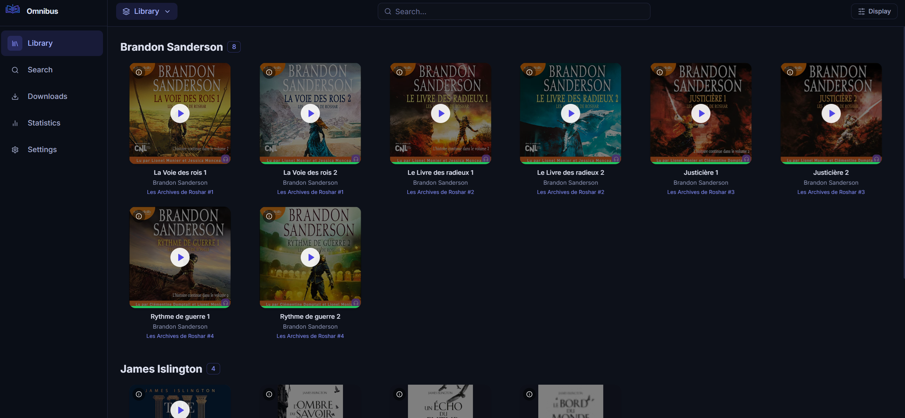
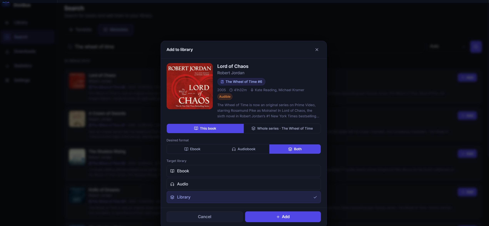
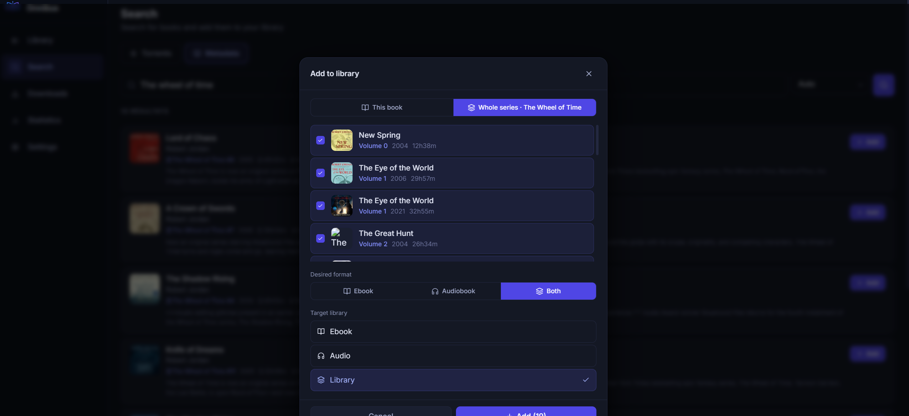
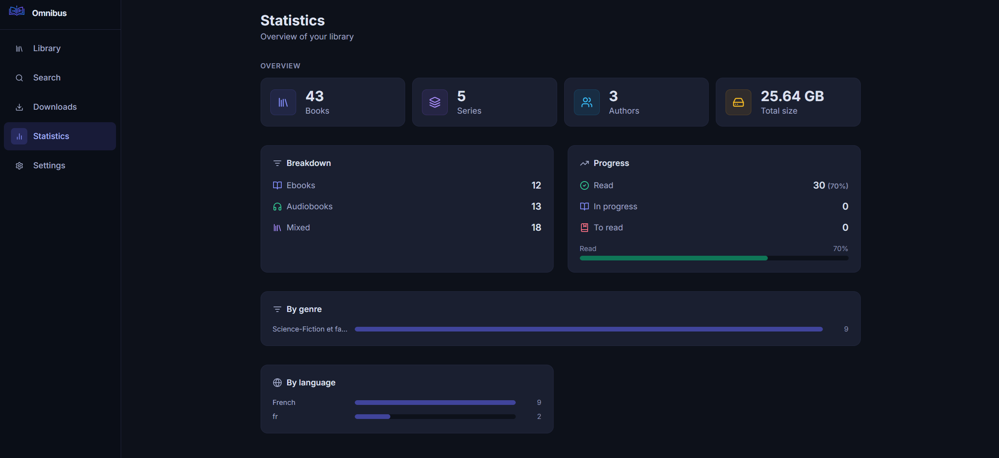

# </img> Omnibus 
A Self-hosted library manager for ebooks & audiobooks

<p align="center">
  <a href="LICENSE">
    
  </a>
  <a href="https://nodejs.org">
    
  </a>
  
  
  
</p>

---

Omnibus is a **Radarr/Sonarr-style media manager for ebooks and audiobooks**. Search torrents through Prowlarr, manage downloads across multiple torrent clients, organize your library, read EPUBs in-browser, and listen to audiobooks — all from a responsive dark-themed web UI.

It runs as a **single Docker container** with no external database required.

---

## Table of Contents

- [Features](#features)
- [Screenshots](#screenshots)
- [Requirements](#requirements)
- [Installation](#installation)
  - [Docker](#docker)
  - [Docker Compose](#docker-compose)
- [Configuration](#configuration)
  - [Environment Variables](#environment-variables)
  - [Config Files](#config-files)
- [Rename Patterns](#rename-patterns)
- [Reverse Proxy](#reverse-proxy)
- [Authentication](#authentication)
- [Contributing](#contributing)
- [License](#license)

---

## Features

### 📚 Library
- Scan directories for ebooks (EPUB, PDF) and audiobooks (MP3, M4B, FLAC, OPUS, OGG, AAC, M4A)
- Mixed libraries containing both formats
- Automatic metadata enrichment via **Audible**, **Google Books**, and **Open Library**
- Series grouping, author grouping, cover grid / list views
- Book detail modal with full metadata editing, cover picker, and file browser
- Per-book progress tracking with visual progress bars on covers
- Wishlist system — mark books you want and automatically trigger downloads

### 🔍 Search & Downloads
- Torrent search through **Prowlarr** (configurable indexers and categories)
- Direct metadata catalogue search (without downloading)
- Download queue with real-time progress, status tracking, and error reporting
- Automatic file organization after download using configurable rename patterns
- Torrent client support: **qBittorrent**, **Deluge**, **Transmission**, **rTorrent**, **Aria2**

### 🎧 Audiobook Player
- In-browser streaming (no download required)
- Multi-file audiobook support with per-file progress
- Chapter navigation (M4B ffprobe + filename-based fallback)
- Controls: play/pause, seek, skip ±30 s, speed (0.75×–2×), sleep timer
- Persistent floating player bar across navigation
- Swipe to dismiss on mobile, `navigator.mediaSession` for lock screen / media keys
- Resume position with 10-second rollback

### 📖 Ebook Reader
- In-browser **EPUB rendering** (epub.js)
- 2-page spread mode, font / size / line-height / margin controls
- Table of contents panel, in-book search
- Reading progress saved per book (CFI-based position)

### 🔄 Audio ↔ Ebook Sync
- Synchronize your position between the audiobook and ebook version of the same title
- Transcript-based alignment using **Whisper** (via [Speaches](https://github.com/speaches-ai/speaches))
- Automatic prompt on resume when the other format has a more recent position

### ⚙️ Settings
- Torrent client configuration (multiple clients, per-client download destinations)
- Prowlarr connection and indexer management
- Library path management (add / remove / rescan)
- Rename pattern templates: `{author}`, `{title}`, `{series}`, `{year}`
- Authentication (optional, JWT-based)
- Cron jobs: wishlist auto-download, transcript generation, import polling

---

## Screenshots

| Library | Add book |
|---|---|
|  |  |

| Add Serie | Stats |
|---|---|
|  |  |

---

## Requirements

| Requirement | Notes |
|---|---|
| **Docker** | Recommended for production |
| **Node.js ≥ 20** | For local development only |
| **Prowlarr** | For torrent search — [..docs](https://wiki.servarr.com/prowlarr) |
| Torrent client | One of: qBittorrent, Deluge, Transmission, rTorrent, Aria2 |
| **Speaches** *(optional)* | Whisper API for audio↔ebook sync — [speaches-ai/speaches](https://github.com/speaches-ai/speaches) |

---

## Installation

### Docker

Pull the latest image from Docker Hub:

```bash
docker pull julienpal/omnibus:latest
docker run -d \
  --name omnibus \
  -p 8087:8080 \
  -v ./config:/app/config \
  -v /path/to/your/books:/books \
  -e CONFIG_DIR=/app/config \
  --restart unless-stopped \
  julienpal/omnibus:latest
```

Open **http://localhost:8087** in your browser.

### Docker Compose

Create a `docker-compose.yml` file:

```yaml
services:
  omnibus:
    image: julienpal/omnibus:latest
    ports:
      - "8087:8080"
    volumes:
      - ./config:/app/config
      - /path/to/your/books:/books
    environment:
      - CONFIG_DIR=/app/config
    restart: unless-stopped
```

Then run:

```bash
docker-compose up -d
```

Open **http://localhost:8087** in your browser.

---

## Docker Compose

### Minimal

```yaml
services:
  omnibus:
    build: .
    ports:
      - "8087:8080"
    volumes:
      - ./config:/app/config
      - /path/to/your/books:/books
    environment:
      - CONFIG_DIR=/app/config
    restart: unless-stopped
```

### With Speaches — GPU transcription (recommended for sync)

```yaml
services:
  omnibus:
    build: .
    ports:
      - "8087:8080"
    volumes:
      - ./config:/app/config
      - /path/to/your/books:/books
    environment:
      - CONFIG_DIR=/app/config
    restart: unless-stopped

  speaches:
    image: ghcr.io/speaches-ai/speaches:latest-cuda
    ports:
      - "8000:8000"
    volumes:
      - hf-hub-cache:/home/ubuntu/.cache/huggingface/hub
    environment:
      - WHISPER__NUM_WORKERS=4
      - WHISPER__COMPUTE_TYPE=float16
    restart: unless-stopped
    deploy:
      resources:
        reservations:
          devices:
            - driver: nvidia
              count: all
              capabilities: [gpu]

volumes:
  hf-hub-cache:
```

For CPU-only transcription replace `latest-cuda` with `latest-cpu`.

### Recommended Whisper models

| Model | Speed | Accuracy | VRAM | Notes |
|---|---|---|---|---|
| `Systran/faster-whisper-tiny` | ★★★★★ | ★★☆☆☆ | ~1 GB | Fast, good for testing |
| `Systran/faster-whisper-base` | ★★★★☆ | ★★★☆☆ | ~1 GB | Good balance for short files |
| `Systran/faster-whisper-small` | ★★★☆☆ | ★★★★☆ | ~2 GB | **Recommended** — best speed/accuracy trade-off |
| `Systran/faster-whisper-medium` | ★★☆☆☆ | ★★★★☆ | ~5 GB | Better accuracy, slower |
| `Systran/faster-whisper-large-v3` | ★☆☆☆☆ | ★★★★★ | ~10 GB | Best accuracy, requires a powerful GPU |
| `openai/whisper-large-v3-turbo` | ★★★☆☆ | ★★★★★ | ~6 GB | OpenAI's optimised large model |

> **Tip:** With `WHISPER__NUM_WORKERS=4` on Speaches and `concurrency=4` in Settings → Whisper, throughput scales linearly. A 20-hour audiobook transcribes in ~1 hour with `faster-whisper-small` on a mid-range GPU.

---

## Configuration

All settings are stored as JSON files under `./config/` (or the path set by `CONFIG_DIR`). They are **created automatically with defaults on first run** — you should not need to edit them manually; the Settings UI handles everything.

### Environment Variables

| Variable | Default | Description |
|---|---|---|
| `CONFIG_DIR` | `<cwd>/config` | Override the config directory (useful for Docker volumes) |
| `PORT` | `8686` | Override the backend Express port |
| `BASE_PATH` | *(empty)* | Mount the app under a sub-path (e.g. `/omnibus`) — applied at container startup |

See [`backend/.env.example`](backend/.env.example) for a ready-to-copy template.

### Config Files

| File | Description |
|---|---|
| `app.json` | Port, auth, rename patterns, Whisper endpoint, cron schedules |
| `prowlarr.json` | Prowlarr URL, API key, and cached indexer list |
| `clients.json` | Torrent client connections and download destinations |
| `libraries.json` | Library paths and their type (`ebook`, `audiobook`, `mixed`) |
| `player-progress.json` | Audiobook playback positions (per book) |
| `reader-progress.json` | Ebook reading positions (CFI, per book) |

> `prowlarr.json` can grow large because it caches all indexer category data — this is normal.

---

## Rename Patterns

After a download completes, files are moved to a library path using a template pattern. Configure separate patterns for ebooks and audiobooks in **Settings → General**.

| Token | Value |
|---|---|
| `{author}` | Author name |
| `{title}` | Book title |
| `{series}` | Series name (falls back to title if empty) |
| `{year}` | Publication year |

**Examples:**

```
{author}/{series}/{title}       → Brandon Sanderson/Stormlight Archive/The Way of Kings
{author}/{title} ({year})       → Brandon Sanderson/The Way of Kings (2010)
{series}/{title}                → Stormlight Archive/The Way of Kings
```

---

## Reverse Proxy

### nginx

```nginx
server {
    listen 80;
    server_name omnibus.example.com;

    location / {
        proxy_pass         http://localhost:8087;
        proxy_set_header   Host $host;
        proxy_set_header   X-Real-IP $remote_addr;
        proxy_set_header   X-Forwarded-For $proxy_add_x_forwarded_for;
        # Required for audio streaming (range requests)
        proxy_buffering    off;
    }
}
```

To serve Omnibus under a sub-path (e.g. `https://example.com/omnibus`), set `BASE_PATH=/omnibus` and configure nginx accordingly:

```nginx
location /omnibus/ {
    proxy_pass         http://localhost:8087/omnibus/;
    proxy_set_header   Host $host;
    proxy_set_header   X-Real-IP $remote_addr;
    proxy_set_header   X-Forwarded-For $proxy_add_x_forwarded_for;
    proxy_buffering    off;
}
```

### Caddy

```
omnibus.example.com {
    reverse_proxy localhost:8087
}
```

With a sub-path:

```
example.com {
    handle_path /omnibus/* {
        reverse_proxy localhost:8087
    }
}
```

> Pass `BASE_PATH` as an environment variable at runtime.

---

## Authentication

Authentication is **disabled by default**. To enable it:

1. Go to **Settings → Authentication**
2. Toggle "Enable authentication"
3. Set a username and password
4. Save — the server will restart with JWT auth enforced

All API routes (except `/api/auth/*`) will then require a `Bearer` token in the `Authorization` header.

---

## Contributing

All contributions are welcome! If you'd like to help:

1. Fork the repository
2. Create a feature branch — `git checkout -b feat/my-feature`
3. Commit your changes with clear messages
4. Open a pull request

For larger changes, open an issue first to discuss the design.

For detailed guidelines on adding torrent clients, metadata providers, or working with the codebase, see [.docs/contributing.md](.docs/contributing.md).

---

## Documentation

| Document | Description |
|---|---|
| [.docs/setup.md](.docs/setup.md) | Detailed installation, Docker, env vars, reverse proxy |
| [.docs/api.md](.docs/api.md) | Full REST API reference |
| [.docs/architecture.md#tech-stack](.docs/architecture.md#tech-stack) | Tech stack |
| [.docs/architecture.md#project-structure](.docs/architecture.md#project-structure) | Project structure |
| [.docs/architecture.md](.docs/architecture.md) | Architecture & data flow |
| [.docs/contributing.md](.docs/contributing.md) | Contributing guide, code style, adding providers & clients |

---

## License

MIT — see [LICENSE](LICENSE) for details.

